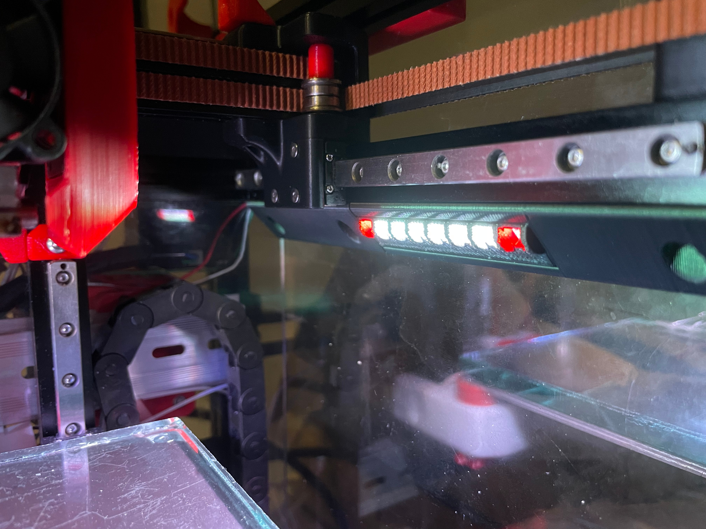

### [中文说明](readme_CN.md)

Inspired by [V0-Adafruit-Y_Rails](https://github.com/VoronDesign/VoronUsers/tree/master/printer_mods/QuackProfit/V0-Adafruit-Y_Rails)

Printing
Default Voron settings

No supports needed

### 2023-01-28 Update
There are two versions you can choice now. please note that they with difference spacing between LEDs.

32LEDS (spacing between LEDs 7.07mm)
16LEDs(spacing between LEDs 6.99mm)

### Picture



### [Video](3D/V0_NeoPixel_SticksB.avi)

### BOM
|NO.	|Category	|Part Name	|Qty	|Remark
|--|--|--|--|--|
|1	|Electronics	|[NeoPixel Stick](https://item.taobao.com/item.htm?spm=a1z09.2.0.0.7ca02e8djWSvge&id=623844944291&_u=dkh2792dc2)	|X1	|59*10.5mm
|2	|Fasteners|M3x6BHCS		|X6	|
|3	|Fasteners|M3 Nut		|X6	|
|4	|Fasteners|20awg		|1.5m	|

## Config
Inspired by SB led
#### 1. Copy["neopixel_leds.cfg"](Config/neopixel_leds.cfg)to"Config"folder
#### 2. Copy below config to your <Printer.cfg>，you must need to check the “pin:” in "neopixel_leds.cfg"
```ini
[include neopixel_leds.cfg]
## LEDs Config
```


