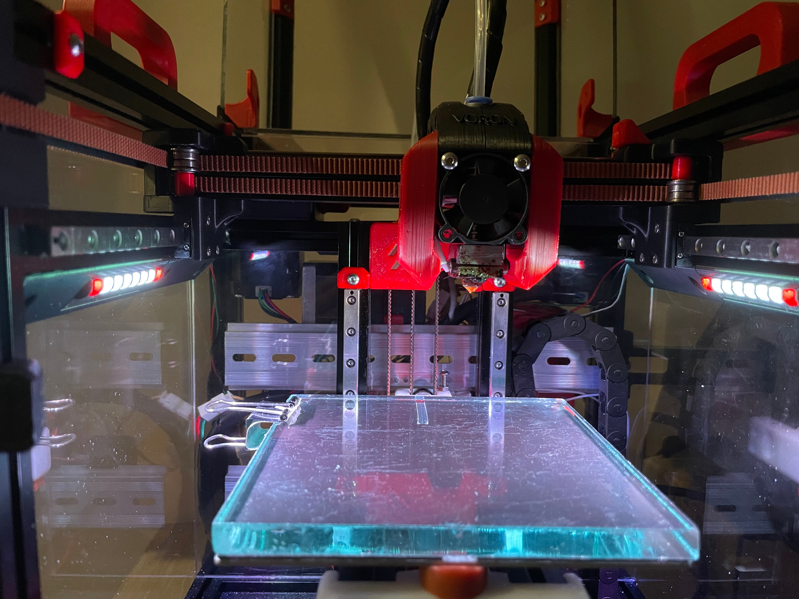
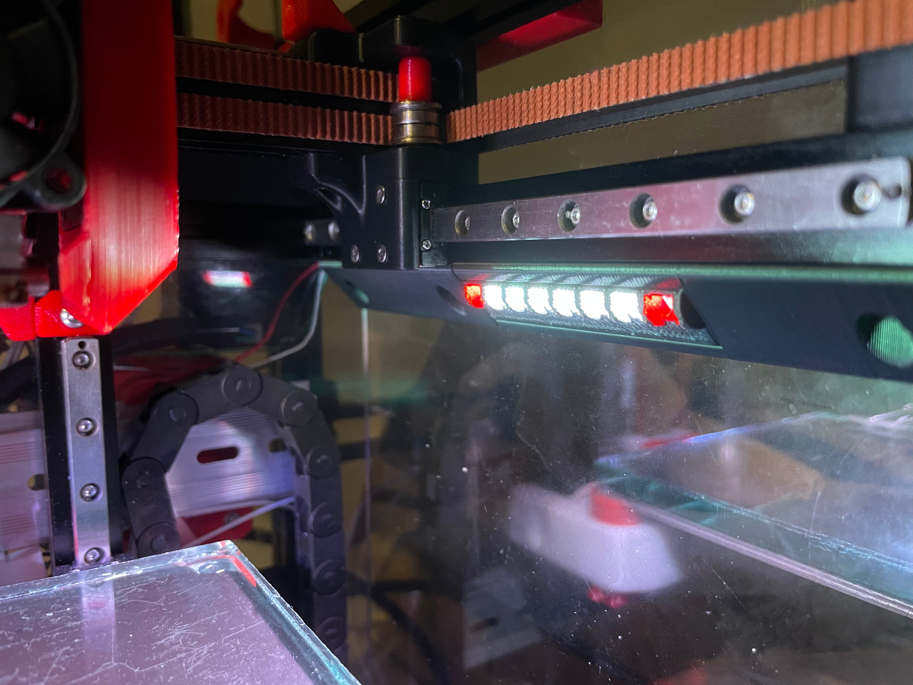
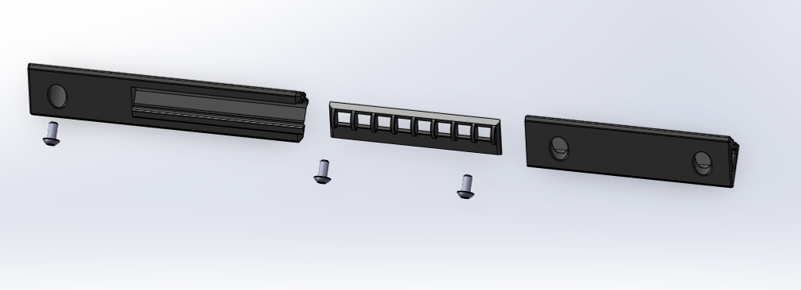

### [English Introductions](readme.md)

本项目参考了 [V0-Adafruit-Y_Rails](https://github.com/VoronDesign/VoronUsers/tree/master/printer_mods/QuackProfit/V0-Adafruit-Y_Rails)

### 打印

参考Voron默认参数

无需支撑

### 照片



### [视频](3D/V0_NeoPixel_SticksB.avi)

### 材料清单 (BOM)
|序号	|种类	|名称	|数量	|备注
|--|--|--|--|--|
|1	|电子	|[NeoPixel Stick](https://item.taobao.com/item.htm?spm=a1z09.2.0.0.7ca02e8djWSvge&id=623844944291&_u=dkh2792dc2)	|X1	|59*10.5mm
|2	|紧固件|M3x6BHCS		|X6	|
|3	|紧固件|M3 Nut		|X6	|
|4	|紧固件|20awg		|1.5m	|

## 配置
参考 SB led
#### 1.复制[neopixel_leds.cfg](config/neopixel_leds.cfg)到Config文件夹
#### 2.复制下列配置到<Printer.cfg>，你必须检查 "neopixel_leds.cfg"中的“pin:”
```ini
[include neopixel_leds.cfg]
## LEDs Config
```
